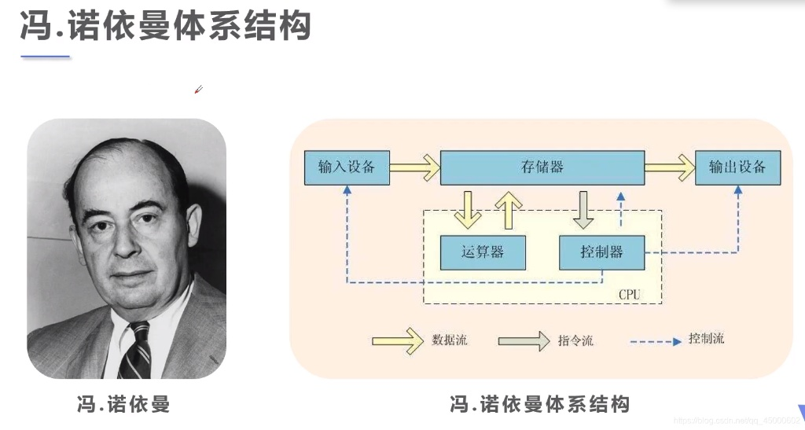

# 计算机组成与体系结构

## 1.1 计算机系统组成

计算机是一个硬件和软件的综合体，可以把它看成按功能划分的多层次结构。

### 1.1.1 计算机硬件的组成

冯诺伊曼计算机结构：

#### 控制器

控制器（Control Unit）是 CPU 的核心组成部分之一，负责从存储器取指、译码并生成控制信号，以协调运算器、寄存器、存储器与 I/O 设备的协作。

- **典型组成模块：**
  - **程序计数器（PC）**：保存下一条指令地址。
  - **指令寄存器（IR）**：存放当前执行的指令。
  - **指令译码器（ID）**：将指令译成具体控制操作。
  - **时序/控制信号发生器**：产生同步的细粒度控制脉冲。
  - **状态/标志寄存器**：记录运算结果的状态（零、进位等）。

#### 运算器 (Arithmetic And Logic Unit ALU)

运算器是 CPU 中负责执行算术与逻辑操作的核心模块，直接处理来自寄存器或存储器的操作数并输出运算结果与状态标志。

- **典型组成：**
  - **算术/逻辑核心（ALU）**：用于快速完成基本运算；
  - **累加寄存器（AC）**：通用寄存器，为 ALU 提供一个工作去，暂存数据；
  - **数据缓存器（DR）**：写内存时暂存指令或数据
  - **状态条件寄存器（PSW）**：存状态标志与控制标志

#### 主存储器

存储现场操作的信息与中间结果，包括机器指令和数据。

#### 辅助存储器

存储需要长时间保存的各种信息。

#### 输入设备

把人们编写好的程序与数据送入计算机中去，且把他们转化成计算机内部所能识别和接受的信息的方式。

键盘、鼠标、扫描仪

#### 输出设备

将计算机处理结果以人类能接受的方式输送出计算机。目前最常用的输出设备是打印机与显示器。

### 1.1.2 计算机结构的分类

计算机经历了电子管、晶体管、集成电路时代。

1. 存储程序的概念，
   a. 计算机有运算器、存储器、控制器、输入设备、输出设备五大部件组成。
   b. 计算机内部使用二进制表示指令和数据。
   c. 将编好的程序和数据存入存储器，然后再启动计算机工作。这就是存储程序的基本概念。

2. Flynn 分类 根据指令流、数据流的多倍性特性对计算机进行分类。
   a. 单指令流单数据流（Single Instruction stream and Single Data stream）：SISD 顺序执行的单处理器计算机，其指令部件每次只对一条指令进行译码，并只对一个操作部件进行分配数据。
   b. 单指令流多数据流（Single Instruction stream and Multiple Data stream）：SIMD 以并行处理机为代表，并行处理机包括多个重复的处理单元，由单一指令部件控制，按照同一指令流为它们分配各自所需的不同数据。
   c. 多指令流单数据流（Multiple Instruction stream and Single Data stream）：MISD 具有 n 个处理单元，按 n 条不同指令的要求对同一数据流及其中间结果进行不同的处理。一个单元的输出又作为另一个单员的输入。
   d. 多指令流多数据流（Multiple Instruction stream and Multiple Data stream）：MIMD 能实现作业、任务、指令等各级全面并行的多机系统。

### 1.1.3 复杂指令集系统与精简指令集系统

在计算机结构发展过程中，指令系统优化设计有两个截然相反的方向，一个只增强指令的功能，设置一些复杂的指令，把一些原来由软件实现的、常用的功能该用硬件的指令系统来实现，这种计算机称为复杂指令系统计算机（Complex Instruction Set Computer， CISC）。另一个是尽量简化指令功能，只保留那些功能简单，能在一个节拍内执行完成的指令，较为复杂的功能使用一段子程序来实现，这种计算机系统称为精简指令系统计算机（Reduced Instruction Set Computer， RISC）。

- CISC 指令系统特点
  - 指令数量众多，通常由 100 ～ 250 条。
  - 指令使用频率相差悬殊，20% 的简单指令使用频率为 80%。
  - 支持多种寻址方式。
  - 变长指令，译码电路的复杂性增加了。
  - 指令可以直接对主从单元的数据进行处理。
  - 以微程序控制为主。
- RISC 指令系统特点
  - 指令数量少，只提供 LOAD（从存储其中读数）和 STORE（把数据写入存储器）两条指令对存储器进行操作。其余所有操作都在 CPU 的寄存器之间进行。
  - 指令寻址方式少，只支持寄存器寻址、立即数寻址、相对寻址方式。
  - 指令长度固定，指令格式种类少。
  - 以硬布线逻辑控制为主。
  - 单周期指令执行，采用流水线技术。
  - 优化的编译器，RISC 的精简指令集使编译工作简单化。
  - CPU 中的通用寄存器多，一般在 32 个以上。
  - 大多数 RISC 使用 Cache 方案。

### 1.1.4 总线

总线是一组能为多个部件分时共享的公共数据传输线路，共享是指总线上可以挂接多个部件，各个部件互相交换的信息都可以通过这组公共线路传输。分时是指多个部件同时只能有一个部件向总线发送消息。可以多个部件同时读取。

CPU 内部的总线叫内部总线，CPU 外部的总线叫外部总线，CPU 通过总线实现程序取指令，内存外设的数据交换。按功能可以分为地址总线、数据总线、控制总线。

## 1.2 存储器系统

存储器是来存储程序和数据的部件。是计算机能实现存储程序控制的基础。

存储器使用多级存储体系，Cache、主存、辅存。

存储器中的数据存取方式：

1. 顺序存取，只能按特定顺序访问，例：磁带。
2. 直接存取，使用一个共享的读写装置，每个数据块都拥有唯一的标识，可以直接移动至某个地址进行访问，例：磁盘。
3. 随机存取，每一个可寻址单元都具有唯一的地址和读写装置，系统可以在同一时间时间内对任一存储单元进行访问，例：主存储器。
4. 相联存取，选择某一单元读取是去取决于内容而不是其地址，可以对所有单元进行特定位比较，选择符合条件的单元进行访问，例：Cache。

### 1.2.1 主存储器

随机存储器（Random Access Memory， RAM）即可以写入也可以读出，断电后信息丢失，因此只能用户暂存数据，RAM 又可分为 DRAM（Dynamic RAM， 动态 RAM）和 SRAM （Static RAM， 静态 RAM）两种。DRAM 信息会随时间逐渐消失，因此需要定时刷新以维持信息。SRAM 能在不断电的情况下保证数据一直不丢失。

只读存储器（Read Only Memory， ROM）存储器内容只能随机读出而不能写入，即使断电信息也不会丢失。ROM 一般用于存放 BIOS（Basic Input Output System）。现在的 BIOS 已经升级位使用 Flash ROM，通电重新写入数据。

内存编址方法：在计算机系统中，存储器中每个单元的位数时相同且固定的，称为存储器编址单位。内存一般以字节（8位）为单位，或者以字位单位（字的长度可大可小，比如 32位 64位）。

### 1.2.1 辅助存储器

1. 磁带存储器：存取时间长，容量大，价格便宜。
2. 光存储器：CD/DVD。
3. 硬盘存储器：主要分为磁盘类如机械硬盘（Hard Disk Drive，HDD）和固态存储类如固态硬盘（Solid State Drive， SSD）。
机械硬盘的工作原理：
一个硬盘驱动中有多个磁盘片，每个盘片有两个记录面，每个记录面对应一个磁头，所以记录面号就是磁头号，所有磁头都安装在一个公共的传动设备或支架上，磁头一致地沿盘面镜像移动，单个磁头不能单独移动，在记录面上，一条条磁道组成一个同心圆，最外圈的磁道号为 0 号，往内侧逐步增加。
存储时优先存入同一柱面，如果存放不完则存入相邻的柱面。
通常将一条磁道划分为若干个段，每个段称为一个扇区或扇段，每个扇区存放一个鼎昌的信息块例如 512 字节。一条磁道分为多少扇区，每个扇区存放多少字节，一般由操作系统决定。扇区编号从 1 开始。
磁盘访问时间 = 寻道时间+旋转延迟时间。
固态硬盘的工作原理：
用闪存芯片存数据，而不是用盘片和磁头

### 1.2.3 Cache 存储器

Cache 的功能是提高 CPU 数据输入输出的速率，Cache 通常采用相联存储（ContentAddress Memory，CAM）。CAM 是一种基于内容进行访问的存储设备。对其进行写入时，自动使用未使用的单元存储，当要读出数据时，不是给出其存储单元的地址，而是直接给出其数据或者该数据的一部分内容。CAM 对所有存储单元的数据同时进行比较，标记符合条件的所有数据。

1. 基本原理：局部性原理。`t3（Cache+主存储器平均周期）= t1 （Cache 周期）+ h *（命中率） + t2（内存周期）* （1-h）`
2. 映射机制：当 CPU 发出访存后，存储地址先被送到 Cache 控制器以确定所需数据是否已在 Cache 中，若命中则直接进行访问。这个过程称为 Cache 的地址映射（映像）。
  **直接映射**
  直接映像方式以随机存储器作为 Cache 存储器，硬件电路比较简单。在进行映像时，主存地址被分成三个部分，从高到低依次为：区号、页号及页内地址，

  | 7位  | 4位        | 19位       |
  | ---- | ---------- | ---------- |
  | 区号 | 页号       | 页内地址   |
  |      | cache 地址 | cache 地址 |

  直接映射中，某一分区的第 N 页，必须进入 Cache 的第 N 页。

  b. 全相联映射，全相联映像使用相联存储器组成的 Cache 存储器。在全相联映像方式中，主存的每一页可以映像到 Cache 的任一页。 如果淘汰 Cache 中某一页的内容， 则可调入任一主存页的内容，因而较直接映像方式灵活。

  主存地址不能直接取 Cache 页号，而时需要将主存页标记与 Cache 页标记进行比较。因此速度很慢。

  | 11位     | 19位       |
  | -------- | ---------- |
  | 主存页号 | 页内地址   |
  |          | cache 地址 |

  c. 组相联映射
  组相联映像介于直接映像和全映像之间，是这两种映射的折衷方案。在组相联映像方式中，主存与 Cache 都分组，主存中一个组内的数与 Cache 的分组数相同。

  主存中的组与 Cache 形成直接映射关系，而每个组内的页时全相联映像。

  | 7位  | 4位        | 1 位       | 19位       |
  | ---- | ---------- | ---------- | ---------- |
  | 区号 | 组号       | 组内页号   | 页内地址   |
  |      | cache 地址 | cache 地址 | cache 地址 |

  组相联映像主存地址
3. 替换算法
  （1） 随机算法
  （2） 先进先出
  （3） 近期最少使用（LRU）。
4. 写操作
  （1）直达写（写 Cache 同时写主存）
  （2）写回（先写 Cache，Cache 淘汰时写主存）
  （3）标记法

## 1.3 流水线

流水线技术把一个任务分解为若干顺序执行的子任务，不同的子任务由不同的执行机构负责执行，而这些机构可以同时并行工作。在任一时刻任一任务只占用其中一个执行机构，这样就可以实现多个任务的重叠执行，以提高工作效率。

### 1.3.1 流水线周期

流水线应用中，会将需要处理的工作分为 N 个阶段，最耗时的那一段消耗的时间为流水线周期。每条指令取指 2ms，分析 4ms，执行 1ms，那么流水线周期为 4 ms。

### 1.3.2 流水线执行时间

将一个任务分为 N 个阶段，每个阶段执行时间为 t。则完成该任务所需的时间为 Nt。若已传统方式完成 k 个任务所需的时间为 kNt。而使用流水线技术执行的时间为 `Nt + (k-1)t`

流水线的执行时间=第一条指令的执行时间+(n-1)*流水线周期

n 代表处理任务的数量。

100 条指令执行时间

2+4+1+(100-1)*4=403ms

实际会将每个执行阶段的时间统一为流水线周期

4+4+4+(100-1)*4=408ms

### 1.3.3 流水线的吞吐率

流水线的吞吐率（代表实际完成情况，Though Put rate，TP），是指在在单位时间内流水线完成的任务数量或输出的结果数量。

TP = n/kt

n 为任务数量，kt 为处理完 n 个任务所需要的时间。

### 1.3.4 流水线的加速比

完成同样一批任务，不使用流水线所用的时间与使用流水线所用的时间之比称为流水线加速比，T0 为不使用流水线所用的时间，Tk 为使用流水线所用的时间。

S = T0/Tk

如果流水线各个流水段的执行时间为 Dt，一条 k 个流水段的 n 个连续任务所需要的时间为 `（k+n-1）Dt`，如果不使用流水线顺序执行这 n 个任务，则所需要的时间为 `n*k*Dt`。

S = nkDt/(k+n-1)Dt = nk/(k+n-1)
