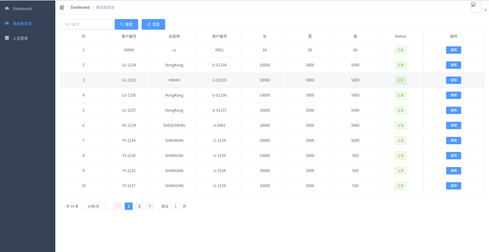

# 港口货运管理平台
- [docker 软件安装及基本操作](docker.md)
- [protoc 安装及基本操作](protoc.md)
- [container微服务](container.md)
- [container api ](container-api.md)
- [container 微服务运行及访问](container-sum.md)
- [vue-element-template 安装](vue.md)
- [container vue编写](container-vue.md)

# Kubernetes 港口货运管理平台
- [kubernetes 安装入门](kubernetes.md)