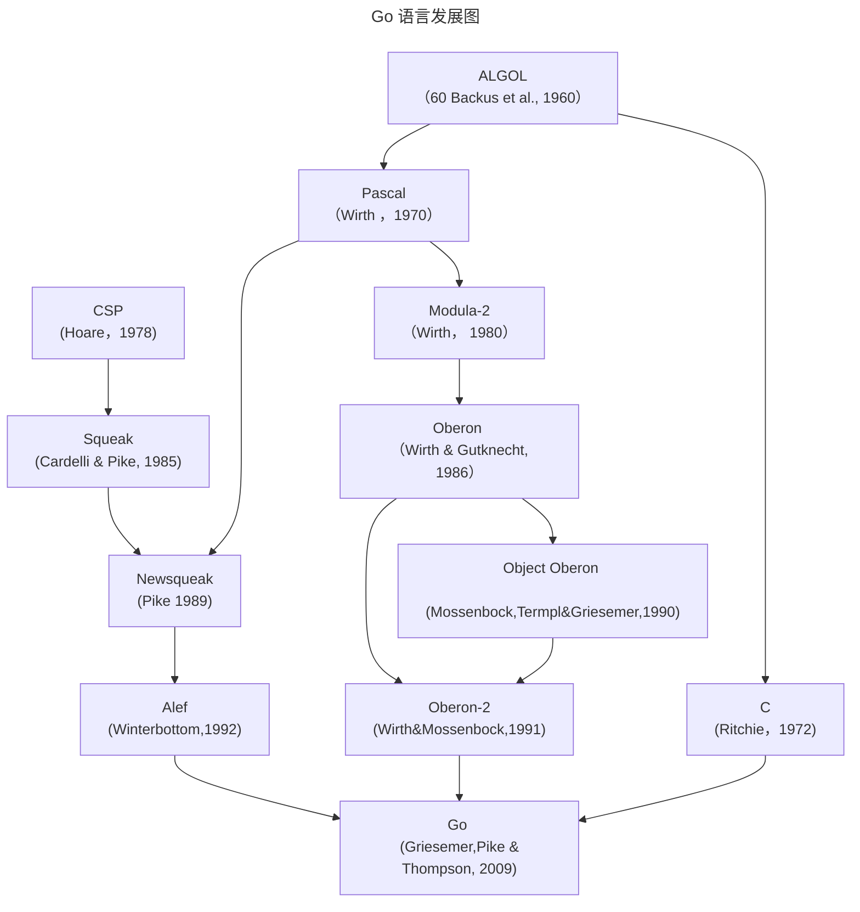

## Go 语言起源

编程语言的演化就像生物物种的演化类似，一个成功的编程语言的后代一般都会继承他们祖先的优点；当然有时多种语言杂合也可能会产生令人惊讶的特性；还有一些激进的新特性可能并没有先例。我们可以通过观察编程语言和软硬件是如何互相促进、互相影响的演化过程而学到很多。

下图展示了有哪些早期的编程语言对 Go 语言的设计产生了重要影响。



`Go` 语言有时候被描述为 “类 `C` 语言”，或者是 21 世纪的 `C` 语言。`Go` 从 `C` 语言继承了相似的表达式语法、控制流结构、基础数据类型、调用参数传值、指针等很多思想，还有 `C` 语言一直所看重的编译后机器码的运行效率以及和现有操作系统的无缝适配。

但是在 `Go` 语言的家族树中还有其他的祖先。其中有一个影响力的分支来自 [Niklaus Wirth](https://en.wikipedia.org/wiki/Niklaus_Wirth) 所设计的 `Pascal` 语言。然后 `Modula-2` 语言激发了包的概念。然后 `Oberon` 语言摒弃了模块接口文件和模块实现文件之间的区别。第二代的 `Oberon-2` 语言直接影响了包的导入和声明的语法，还有`Oberon`语言的面向对象特性所提供的方法的声明语法等。

`Go` 语言的另一支祖先，带来了`Go` 语言有别于其他语言的重要特性，灵感来自贝尔实验室的 [Tony Hoare](https://en.wikipedia.org/wiki/Tony_Hoare) 于1978年发表的鲜为外界所知的关于并发研究的基础文献 *顺序通信进程*（ communicating sequential processes，缩写为`CSP`）。在`CSP`中，程序是一组中间没有共享状态的平行运行的处理过程，它们之间使用管道进行通信和控制同步。不过 [Tony Hoare](https://en.wikipedia.org/wiki/Tony_Hoare) 的 `CSP` 只是一个用于描述并发性基本概念的描述语言，并不是一个可以编写可执行程序的通用编程语言。

接下来， Rob Pike 和其他人开始不断尝试将 [CSP](https://en.wikipedia.org/wiki/Communicating_sequential_processes) 引入实际的编程语言中。他们第一次尝试引入 `CSP` 特性的编程语言叫 [squeak](http://doc.cat-v.org/bell_labs/squeak/) (老鼠间交流的语言)，是一个提供鼠标和键盘事件处理的编程语言，它的管道是静态创建的。然后是改进版的 [Newsqueak](http://doc.cat-v.org/bell_labs/squeak/) 语言，提供了类似 `C` 语言语句和表达是的语法和类似 `Pascal` 语言的推导语法。`Newsqueak` 是一个带垃圾回收的纯函数式语言，它再次针对键盘、鼠标和窗口事件管理。但是在 `Newsqueak`  语言中管道是动态创建的，属于第一类值，可以保存到变量中。

在 Plan9 操作系统中，这些优秀的想法被吸收到了一个叫 Alef 的编程语言中。Alef 试图将 `Newsqueak` 语言改造为系统编程语言，但是因为缺少垃圾回收机制而导致并发编程很痛苦。

`Go` 语言的一些其他特性零散地来自于其他一些编程语言；比如 iota 语法是从 APL 语言借鉴，词法作用域与嵌套函数来自于 `Scheme` 语言。当然，我们也可以从 `Go` 中发现很多创新的设计。比如 Go 语言的切片为动态数组提供了有效的随机存取的性能，这可能会让人联想到链表的底层的共享机制。还有 Go 语言新发明的 defer 语句。

## Go 语言项目

所有的编程语言都反映了语言设计者对编程哲学的反思，通常包括之前的语言所暴露的一些不足地方的改进。`Go` 项目是在 Google 公司维护超级复杂的几个软件系统遇到的一些问题的反思（但是这类问题绝不是 Google 公司所特有的）。

正如 Rob Pike 所说，“软件的复杂性是乘法级相关的”，通过增加一个部分的复杂性来修复问题通常将慢慢地增加其他部分的复杂性。通过增加功能、选项和配置是修复问题的最快途径，但是这很容易让人忘记简洁的内涵，既从长远来看，简洁依然是好软件的关键因素。

简洁的设计需要在工作开始的时候舍弃不必要的想法，并且在软件的生命周期内严格区别好的改变和坏的改变。通过足够的努力，一个好的改变可以在不破坏原有完整概念的前提下保持自适应，正如 Fred Brooks 所说的“概念完整性”；而一个坏的改变则不能达到这个效果，他们仅仅是通过肤浅和简单的妥协来破坏原有设计的一致性。只有通过简洁的设计，才能让一个系统保持稳定、安全和持续的进化。

`Go` 项目包括编程语言本身，附带了相关的工具和标准库，最后但并非代表不重要的是，关于简洁编程哲学的宣言。就事后诸葛亮的角度来看，`Go` 语言的这些地方都做的还不错：拥有自动垃圾回收、一个包系统、函数作为一等公民、词法作用域、系统调用接口、只读的 UTF8 字符串等。但是 `Go` 语言本身只有很少的特性，也不太可能添加太多的特性。例如，它没有隐式的数值转换、没有构造函数和析构函数、没有运算符重载、没有默认参数、没有泛型（1.19 已有）、没有继承、没有异常没有宏、没有函数修饰、更没有线程局部存储。但是，语言本身是成熟和稳定的，而且承诺保证向后兼容：用之前的 `Go` 语言编写的程序可以用新版本的 `Go` 语言编译器和标准库直接构建而不需要修改代码。

`Go` 语言有足够的类型系统以避免动态语言中那些粗心的类型错误，但是，`Go` 语言的类型系统相比传统的强类型语言又要简洁很多。虽然，有时候这会导致一个“无类型”的抽象概念，但是 `Go` 语言程序员并不需要像 `C++` 或 `Haskell` 程序员那样纠结于具体类型的安全属性。在实践中， `Go` 语言简洁的类型系统会给程序员带来了更多的安全性和更好的运行时性能。

`Go` 语言鼓励当代计算机系统设计的原则，特别是局部的重要性。它的内置数据类型和大多数的准库数据结构都经过精心设计而避免显式的初始化或隐式的构造函数，因为很少的内存分配和内存初始化代码被隐藏在库代码中了。 `Go` 语言的聚合类型（结构体和数组）可以直接操作他们的元素，只需要更少的存储空间、更少的内存写操作，而且指针操作比其他间接操作的语言也更有效率。由于现代计算机是一个并行的机器， `Go` 语言提供了基于 `CSP` 的并发特性支持。`Go` 语言的动态栈使得轻量级线程 `goroutine` 的初始栈可以很小，因此，创建一个 `goroutine` 的代价很小，创建百万级的 `goroutine` 完全是可行的。

`Go` 语言的标准库（通常被称为语言自带的电池），提供了清晰的构建模块和公共接口，包含`I/O` 操作、文本处理、图像、密码学、网络和分布式应用程序等，并支持许多标准化的文件格式和编解码协议。库和工具使用了大量的约定来减少额外的配置和解释，从而最终简化程序的逻辑，而且，每个 `Go` 程序结构都是如此的相似，因此，`Go` 程序也很容易学习。使用 `Go` 语言自带工具构建 `Go` 语言项目只需要使用文件名和标识符名称，一个偶尔的特殊注释来确定所有的库、可执行文件、测试、基准测试、例子、以及特定于平台的变量、项目的文档等；`Go` 语言源代码本身就包含了构建规范。

## 本书的组织

我们假设你已经有一种或多种其他编程语言的使用经历，不管是类似于`C`、`C++` 或 `Java` 的编译型语言，还是类似于 `Python`、`Ruby`、`JavaScript` 的脚本语言，因此我们不会像对完全的编程语言初学者那样解释所有的细节。因为，`Go` 语言的变量、常量、表达式、控制流和函数等基本语法也是类似的。

第一章包含了本教程的基本结构，通过十几个程序介绍了用 `Go` 语言如何实现类似读写文件、文本格式化、创建图像、网络客户端和服务器通讯等日常工作。

第二章描述了 `Go` 语言程序的基本元素结构、变量、新类型定义、包和文件、以及作用域等概念。第三章讨论了数字、布尔值、字符串和常量，并延时了如何显示和处理 Unicode 字符。第四章描述了符合类型，从简单的数组、字典、切片到动态列表。第五章涵盖了函数，并讨论了错误处理、`panic` 和 `recover`，还有 `defer`语句。

第一章到第五章是基础部分，主流命令式编程语言这部分都类似。个别之处，`Go` 语言有自己特色的语法和风格，但是大多数程序员能很快适应。其余章节是 `Go` 语言 特有的：方法、接口、并发、包、测试和反射等语言特性。

`Go` 语言的面向对象机制与一般语言不同。它没有类层次结构，甚至可以说没有类；仅仅通过组合（而不是继承）简单的对象来构建复杂的对象。方法不仅可以定义在结构体上，而且，可以定义在任何用户自定义类型上；并且，具体类型和抽象类型（接口）之间的关系是隐式的，所以很多类型的设计者可能并不知道该类型到底实现了那些接口。方法在第六章讨论，接口在第七章讨论。

第八章讨论了基于顺序通信进程（CSP）概念的并发编程，使用 `goroutines` 和 `channels` 处理并发编程。第九章则讨论了传统的基于共享变量的并发编程。

第十章描述了包机制和包的组织结构。这一章还展示了如何有效地利用 `Go` 自带的工具、使用单个命令完成变异、测试、基准测试、代码格式化、文档以及其他诸多任务。

第十一章讨论了单元测试，`Go` 语言的工具和标准库中集成了轻量级的测试功能，避免了强大但复杂的测试框架。测试库提供了一些基本构件，必要时可以用来构件复杂的测试构件。

第十二章讨论了反射，一种程序在运行期间审视自己的能力。反射是一个强大的编程工具，不过要谨慎地使用；这一章利用反射机制实现一些重要的 `Go` 语言 库函数，展示了反射的强大用法。第十三章解释了底层的编程的细节，在必要时，可以使用 `unsafe` 包绕过 `Go` 语言安全的类型系统。

每一章都有一些练习题，你可以用来测试你对 `Go` 的理解，你也可以探讨书中浙西列子的扩展和替代。

书中的所有代码都可以从 http://gopl.io 上的仓库下载。 `go get` 命令根据每个例子的导入路径智能地获取、构建并安装。只需要选择一个目录作为工作空间，然后将 `GOPATH` 环境变量设置为该路径。

必要时 `Go` 语言工具会创建目录。例如：

```bash
$ export GOPATH=$HOME/gobook    # 选择工作目录
$ go get gopl.io/ch1/helloworld # 获取/编译/安装
$ $GOPATH/bin/helloworld        # 运行程序
Hello, 世界                     # 这是中文

```

运行这些例子需要安装 `Go 1.5` 以上的版本。

```bash
$ go version
go version go1.5 linux/amd64
```

如果使用其他的操作系统，请参考 https://golang.org/doc/install 提供的说明安装。

## 更多的信息

最佳的帮助信息来自 `Go` 语言的官方网站，[https://go.dev](https://go.dev) ，它提供了完善的参考文档，包括编程语言和标准库等诸多权威的帮助信息。同时也包含了如何编写更地道的 `Go` 程序的基本教程，还有各种各样的在线文本资源和视频资源，他们是本书最有价值的补充。`Go` 语言的官方博客 [https://go.dev/blog/](https://go.dev/blog/) 会不定期发布一些 `Go` 语言最好的实践文章，包括当前语言的发展状态、未来的计划、会议报告和 `Go`  语言相关的各种会议的主题等信息（译注： https://go.dev/talks/ 包含了官方收录的各种报告的讲稿）。

在线访问一个有价值的地方是可以从 Web 页面运行 `Go` 语言的程序。这个功能由来自 [https://go.dev/play/](https://go.dev/play/) 的 `Go Playground` 提供，并且可以方便的嵌入到其它页面中。

Playground 可以简单的通过执行一个小程序来测试对语法、语义和程序库的理解，类似其他很多语言提供的 REPL 即时运行的工具。同时它可以生成对应的 `URL` ,非常适合共享 `Go` 语言代码片段、汇报 bug 或者提供反馈意见等。

基于 Playground 构建的 [Go Tour]([A Tour of Go](https://go.dev/tour/welcome/1)) ,是一个系列的 `Go` 语言入门教程，它包含了诸多基本概念和结构相关的并可在线运行的互动小程序。

当然，Playground 和 Tour 也有一些限制，它们只能导入标准库，而且因为安全的原因对一些网络库做了限制。如果要在编译和运行时需要访问互联网，对于一些更复杂的实验，你可能需要在自己的电脑上构建并运行程序。幸运的是下载 `Go` 语言的过程很简单，从 https://go.dev 下载安装包应该不超过几分钟，然后就可以在自己电脑上编写和运行 `Go` 程序了。

`Go` 语言是一个开源项目，你可以在 [Standard library - Go Packages](https://pkg.go.dev/std) 阅读标准库中任意函数和类型的实现代码，和下载安装包的代码完全一致。这样，你可以知道很多函数是如何工作的， 通过挖掘找出一些答案的细节，或者仅仅是出于欣赏专业级 `Go` 代码。