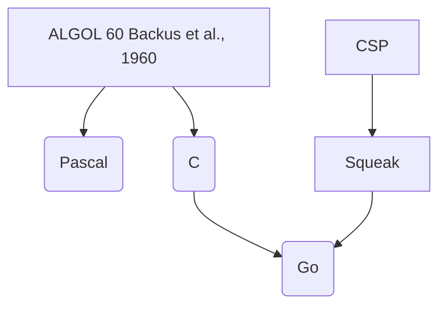

## Go 语言起源

编程语言的演化就像生物物种的演化类似，一个成功的编程语言的后代一般都会继承他们祖先的优点；当然有时多种语言杂合也可能会产生令人惊讶的特性；还有一些激进的新特性可能并没有先例。我们可以通过观察编程语言和软硬件是如何互相促进、互相影响的演化过程而学到很多。

下图展示了有哪些早期的编程语言对 Go 语言的设计产生了重要影响。

```mermaid
graph TD
A[ALGOL 60 Backus et al., 1960] --> B(Pascal)
	A --> C(C)
	C --> G(Go)
AA[CSP] --> AB[Squeak]
AB --> G
```