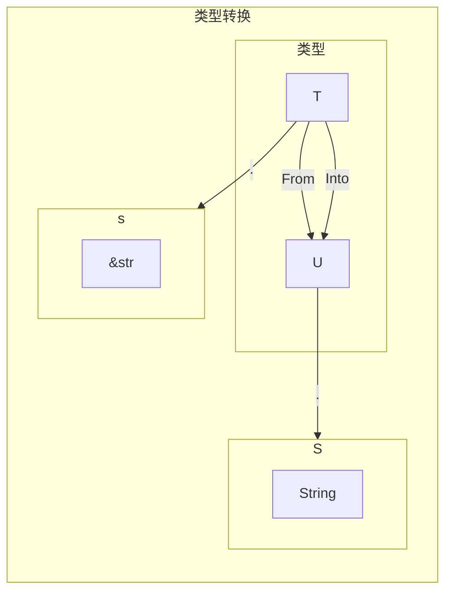

## 类型系统

### 通用概念

所谓类型，其实就是对表示信息的值进行细粒度的区分。比如：整数、小数、文本等。粒度再细一点就是：布尔值、符号整型值、无符号整型值，单精度浮点型、双精度浮点型，字符和字符串，甚至还有各种自定义的类型。

在类型系统中，一切皆类型。基于类型定义的一系列组合、运算和转化等方法，可以看作类型的行为。
类型的行为决定了类型该如何计算，同时也是一种约束，有了这种约束才能保证信息被正确处理。

#### 类型系统的作用

- 排查错误，编译或运行期间进行类型检查。
- 抽象，类型允许开发者站在更高的层面进行思考。
- 文档，明确的类型声明可以表明程序行为。
- 优化效率。
- 类型安全
  - 可以避免类型间的无效计算。
  - 保证内存安全。
  - 避免语义上的逻辑错误。

#### 类型系统的分类

在编译器进行类型检查的语言属于静态类型，在运行期间进行类型检查的语言属于动态类型。如果一门语言不允许类型的自动隐式转换，在强制转换前不同类型无法进行计算，则该语言属于强类型，反之则属于弱类型。

静态类型的语言能在编译期对代码进行静态分析，依靠的就是类型系统。Rust 在编译期间就能检测出数组是否越界访问，运行时抛出错误退出线程，不会因此去访问非法内存，所以 Rust 是类型安全的语言。

动态语言只能在运行时执行类型检查，但是当有数组越界时就回抛出异常退出线程，所以一些动态语言也是内存安全的。

#### 类型系统与多态性

如果一个类型系统允许一段代码在不同的上下文中有不同的类型，这样的类型系统就叫多态类型系统。
现代编程语言包含了三种多态形式：参数化多态（Parametric polymorphism）、Ad-hoc 多态（Ad-hoc polymorphism）、子类型多态（Subtype polymorphism）。如果按多态发生的时间来说又可以静多态（Static polymorphism）和动多态（Dynamic polymorphism）。静多态发生在编译期间，动多态发生在运行时。参数化多态和 Ad-hoc 多态一般时静多态，子类型多态一般是动多态。Rust 语言同时支持静多态和动多态。

参数多态化实际上就是指泛型。
Ad-hoc 多态 也叫特定多态。指同一种行为定义，在不同的上下文中会响应不同的行为实现。Rust 使用 trait 来支持 Ad-hoc 多态。
子类型多态一般用在面向对象语言中。Rust 不支持子类型多态。

### Rust 类型系统概述

Rust 是一种强类型且内存安全的语言。Rust 中一切皆表达式、表达式皆有值，值皆有类型。所以可以说，Rust 一切皆类型。

除了一些基本的原生类型和复合类型，Rust 把作用域也纳入了类型系统（生命周期标记）。

#### 类型大小

编程语言中不同类型本质上是内存占用空间和编码方式的不同，Rust 也不例外。Rust 中没有 GC，内存首先由编译器来分配，Rust 代码被编译为 LLVM IR，其中携带了内存分配的信息。所以编译器需要事先知道内存的大小，才能合理的分配内存。

可确定大小类型和动态类型。Rust 中绝大部分类型都是在编译器可确定大小的类型（Sized Type），比如原生整数类型 u32 固定是 4 个字节。u64 固定事 8 个字节等等，都是可以在编译期间确定大小的类型。然而 Rust 也有少量动态大小的类型（Dynamic Sized Typ， DST），比如 str 类型的字符串字面量，编译器不可能事先知道程序中会出现什么样的字符串，所以对于编译器来说 str 类型的字符串大小事无法确定的。对于这种情况 Rust 提供了引用类型，因为引用总会有固定且编译期已知的固定大小的类型，它由指针和长度信息组成。

&str 存储与栈上（包含指向字符串的指针和字符串长度） str 字符串序列存储与堆上。这种包含了动态大小类型地址信息和携带了长度信息的指针叫做胖指针（Fat Pointer）。

`&[u32; 5]` 和 `&[u32]`（胖指针）空间占用情况
```rust
fn main() {
    assert_eq!(std::mem::size_of::<&[u32; 5]>(), 8);
    assert_eq!(std::mem::size_of::<&[u32]>(), 16);
}
```

零大小类型，Rust 还支持零大小类型（Zero Sized Type，ZST），比如单元类型和单元结构体，大小都是零。

单元类型和单元结构体大小为零，由单元类型组成的数组大小也为零。ZST 类型的特点就是它的值就是其本身，运行时并不占内存空间。

```rust
enum Void {}
struct Foo;
struct Baz {
    foo: Foo,
    qux: (),
    baz: [u8; 0],
}
fn main() {
    assert_eq!(std::mem::size_of::<()>(), 0);
    assert_eq!(std::mem::size_of::<Foo>(), 0);
    assert_eq!(std::mem::size_of::<Baz>(), 0);
    assert_eq!(std::mem::size_of::<Void>(), 0);
    assert_eq!(std::mem::size_of::<[(); 10]>(), 0);
    let baz = Baz {
        foo: Foo {},
        qux: (),
        baz: [],
    };
    assert_eq!(std::mem::size_of_val(&baz), 0);
    assert_eq!(std::mem::size_of_val(&baz.foo), 0);
    assert_eq!(std::mem::size_of_val(&baz.qux), 0);
    assert_eq!(std::mem::size_of_val(&baz.baz), 0);
}

```

在需要使用循环次数的时候可以使用类似技巧，可以获得较高性能。

```rust
fn main() {
    let v : Vec<()> = vec![();10];
    for i in v {
        println!("{:?}", i);
    }
}

```

底类型

底类型是原子类型理论的术语，它其实是 never 类型。
特点：
1. 没有值。
2. 是其他任意类型的子类型。

ZST 是空 never 类型是 无。

Rust 中底类型用!表示（Bang Type）

发散函数（Diverging Function）：会导致线程崩溃或者用于退出的函数 如 `panic!()`、`exit()`
continue 、 break
loop
空枚举

```rust
fn foo() -> ! {
    loop {
        println!("jh")
    }
}
fn main() {
    let i = if false { foo() } else { 100 };
    assert_eq!(i, 100);
}

```

#### 类型推导

类型标注属于语法的一部分。Rust 支持类型推导，只能在局部范围内进行类型推导。

turbofish 操作符, `::<i32>` 为泛型函数标注类型

```rust
fn main() {
    let x = "1";
    // 可以指定类型
    println!("{:?}", x.parse::<i32>().unwrap());
}
```

### 泛型

泛型（Generic）是一种参数化多态。使用泛型可以编写更为抽象的代码，减少工作量。


#### 泛型函数

```rust
fn foo<T>(x: T) -> T {
    return x;
}
fn main() {
    assert_eq!(foo(1), 1);
    assert_eq!(foo("hello"), "hello");
}

```

#### 结构体中使用泛型

`<T>` 叫泛型声明，泛型只有声明之后才能被使用。在为泛型结构体实现具体方法的时候也需要声明泛型类型。

```rust
struct Point<T> {
    x: T,
    y: T,
}
fn main() {
    let p = Point { x: 1, y: 2 };
    assert_eq!(p.x, 1);
    assert_eq!(p.y, 2);
    let fp = Point { x: 1.1, y: 2f64 };
    assert_eq!(fp.x, 1.1);
    assert_eq!(fp.y, 2.0);
}

```

`impl<T>` 此处必须声明泛型 `T` 。 

```rust
#[derive(Debug, PartialEq)]
struct Point<T> {
    x: T,
    y: T,
}

impl<T> Point<T> {
    fn new(x: T, y: T) -> Self {
        Point { x: x, y: y }
    }
}
```

Rust 中的泛型属于静多态，它是一种编译器多态。在编译期间不管是泛型枚举，还是泛型结构体和泛型函数，都会被单态化。单态化是编译器静态分发的一种策略。单态化意味着编译器要为使用到泛型的每个具体类型生成对应个数的具体类型的枚举、结构体、函数。


### 深入 trait

`trait` 是 Rust 对 Ad-hoc 多态的支持，同一个 `trait` 在不同的上下文中实现的行为不同。从语义上来说 `trait` 是在行为上对类型的约束。这种约束可以让 `trait` 有如下四种用法：

- 接口抽象：接口是对类型行为的统一约束。
- 泛型抽象：泛型的行为被 trait 限定在更有限的范围内。
- 抽象类型：在运行时作为一种间接抽象类型去使用，动态地分发给具体的类型。
- 标签 trait：对类型的约束，可以直接作为一种标签使用。

#### 接口抽象

trait 最基础的用法就是进行接口抽象，它有如下特点：
- 接口中可以定义方法，并且支持默认实现。
- 接口中不能实现另一个接口但是可以继承。
- 同一个接口可以同时被多个类型实现，但是一个类型不能实现一个接口多次。
- 使用 impl 为类型实现接口
- 使用 trait 关键字来定义接口

为不同的类型实现 trait，属于一种函数重载，也可以说函数重载就是一种 Ad-hoc 多态。

关联类型

事实上，Rust 中很多操作符都是基于 `trait` 来实现的。比如加法操作符就是一个 `trait` ，加法操作符不仅可以针对 整数、浮点数、也可以针对字符串。

在语义层面上，使用关联类型也增强了 trait 表示这种语义，因为它表示了和某个行为 trait 相关联的类型，在工程上也体现出了高内聚的特点。

add 函数中关联类型 Output 必须制定具体的类型，可以写成 Self、Self::Output、String

```rust
trait Add<RHS = Self> {
    // RHS = Self 为类型参数指定默认值，Self 是每个 trait 都带有的隐式类型参数，代表实现当前 trait 的具体类型
    type Output; // 关联类型
    fn add(self, rhs: RHS) -> Self::Output;
}

impl Add<&str> for String {
    type Output = String; // 实现关联类型
    fn add(mut self, rhs: &str) -> String {
        self.push_str(rhs);
        self
    }
}
```

#### 孤儿规则

如果要实现某个 `trait`，那么该 `trait` 和要实现的那个类型至少有一个要在当前 `crate` 中定义。
```rust
use std::ops::Add;
impl Add<u64> for u32 {
    type Output = u64;
    fn add(self, other: u64) -> Self::Output {
        (self as u64) + other
    }
}
```

当前 `crate` 定义 `trait`
```rust
trait Add<RHS = Self> {
    type Output;
    fn add(self, other: u64) -> Self::Output;
}

impl Add<u64> for u32 {
    type Output = u64;
    fn add(self, other: u64) -> Self::Output {
        (self as u64) + other
    }
}
fn main() {
    let a: u32 = 1;
    let b: u64 = 2;
    println!("{}", a.add(b));
}

```

为本地类型实现加法操作符

```rust
use std::ops::Add;

#[derive(Debug)]
struct Point {
    x: i32,
    y: i32,
}

impl Add for Point {
    type Output = Point;
    fn add(self, rhs: Self) -> Self::Output {
        Point {
            x: self.x + rhs.x,
            y: self.y + rhs.y,
        }
    }
}

fn main() {
    println!("{:?}", Point { x: 1, y: 0 } + Point { x: 2, y: 3 });
}

```

#### trait 继承

Rust 不支持面向对象的传统继承，但是支持 trait 继承。子 trait 可以继承父 trait 中定义或实现的方法。 

```rust
trait Page {
    fn set_page(&self, p: i32) {
        println!("Page default 1");
        println!("Page set: {:?}", p);
    }
}

trait PerPage {
    fn set_per_page(&self, num: i32) {
        println!("Per page default 10");
        println!("Per Page set: {:?}", num);
    }
}

trait Paginate: Page + PerPage {
    fn set_skip_page(&self, num: i32) {
        println!("Skip page: {:?}", num)
    }
}

struct MyPaginate {
    page: i32,
}

impl Page for MyPaginate {}
impl PerPage for MyPaginate {}
// 为所有拥有 Page 和 PerPage 行为的类型实现 Paginate。
impl<T: Page + PerPage> Paginate for T {}

fn main() {
    let my_paginate = MyPaginate { page: 1 };
    my_paginate.set_page(2);
    my_paginate.set_per_page(100);
    my_paginate.set_skip_page(5);
    println!("{:?}", my_paginate.page);
}

```

#### 泛型约束

使用泛型编程时，很多情况下的行为并不是针对所有类型都实现的。
`Add<T, Output = T>` 表示对泛型进行了约束，表示 `sum` 函数的参数必须实现 `Add trait`，并且加号两边的类型必须一致，通过类型参数确定了关联类型 `Output` 也是 `T`，也可以省略参数类型直接写成 `Add<Output = T>`

使用 `trait` 对泛型进行约束，叫 `trait` 限定 (trait Bound)，格式如下：

`fn generic<T: MyTrait + MyOtherTrait + SomeStandardTrait>(t: T){}`

该函数需要一个类型 T，该类型必须实现 MyTrait + MyOtherTrait + SomeStandardTrait 中的全部方法才是使用该函数

```rust
fn sum<T: std::ops::Add<T, Output = T>>(a: T, b: T) -> T {
    a + b
}
fn main() {
    println!("{:?}", sum(1, 2));
}

```

#### 理解 trait 限定

trait 也是一种类型，是一种方法集合，或者说是一种行为集合。

`where` 语句重构限定

```rust
fn foo<T: A, K: B + C, R: D>(a: T, b: K, c: R) {

}

fn foo<T, K, R>(a: T, b: K, c: R) where T: A, K: B + C, R: D {

}
```

#### 抽象类型

trait 还可以用作抽象类型（Abstract Type）。抽象类型属于类型系统的一种，也叫做存在类型（Existential Type）。相对于具体类型而言，抽象类型无法直接实例化。它的每个实例都是具体类型的示例。

对于抽象类型而言，无法确定内存大小，所以 Rust 有两种方法来处理抽象类型：trait 对象 和 impl trait

**trait 对象**

在泛型中使用泛型限定，可以将任意类型的范围根据类型的行为限定到更精确可控的范围。从这个角度出发，也可以将共同拥有相同行为的类型集合抽象为一个类型，这就是 `trait` 对象（trait Object）。因为 `trait` 是对具有相同行为的一组具体类型的抽象，等价于面向对象中封装了一个行为的对象，所以称之为 `trait` 对象。


```rust
pub struct TraitObject {
    pub data: *mut(), // data 指针
    pub vtable: *mut(), // vtable 指针
}
```

`TraitObject` 包括两个指针，`data` 指针 和 `vtable` 指针。以 `impl MyTrait for T` 为例，`data` 指针指向 `trait` 对象保存的数据类型 `T`，`vtable` 指向包含为 `T` 实现的 `MyTrait` 的 `vtable` （`Virtual table`）本质是一个结构体，包含析构函数、大小、对齐和方法等信息。

在编译期间，编译器只知道 `TraitObject` 包含的指针信息，并且大小是确定的。在运行期间当有 `trait_object.method` 方法被调用时，`TraitObject` 会根据虚表指针从虚表中查出正确的指针，然后再进行动态调用。这也是将 trait 对象称之为动态分发的原因之一。

每个 `trait` 都包含一个隐式的类型参数 `Self`,代表实现该 `trait` 的类型。Self 默认有一个隐式的限定 `?Sized`。形如 <Self: ?Sized> 。?Sized 包括了所有的动态大小类型和所有可确定大小的类型。

什么样的 trait 可以被作为 trait 使用？
- trait 的类型参数不能被限定为 Sized。
- trait 中的所有方法都必须是对象安全的。

对象安全的方法必须满足以下三点
- 方法受 Self:Sized 约束
- 方法签名同时满足以下三点
  - 必须不包含任何泛型参数。
  - 第一个参数必须为 Self 类型或可以解引用为 Self 类型。（比如 self、&self、&mut self、self:Box<Self>），没有接收者的方法对对象来说无意义。
  - Self 不能出现在除第一个参数之外的地方
- trait 中不能包含关联常量

#### impl trait 

可以静态分发的抽象类型，如果说 trait 对象是装箱抽象类型（Boxed Abstract Type）。那么 impl trait 就是拆箱抽象类型（Unboxed Abstract Type）。

装箱：将值托管至对内存。
拆箱：在栈内存中生成新的值。

目前 impl trait 只可以在参数和返回值这两个位置使用。

#### 标签 trait

- Sized trait：用来表示编译器可以确定大小的类型。
- Unsize trait：用于标识动态大小类型（DST）。
- Copy trait：用来标识可以按位复制其值的类型。
- Send trait：用来标识可以跨线程安全通信的类型。
- Sync trait：用来标识可以线程间安全共享引用的类型。

##### Sized trait 、Unsize trait

?Sized 包含 Sized trait 和 Unsize trait

Rust 中的动态大小的类型有 trait 和 [T], [T] 代表一定数量的 T 在内存中依次排列，但不知道具体数量，所以它的大小是未知的。用 Unsize 来标记。

当使用 ?Sized 时的注意事项：
- 只可以通过胖指针来操作动态大小类型，比如 &[T]、&Trait 等。
- 变量、参数和枚举变量不能使用动态大小类型。
- 结构体中只有最后一个字段可以使用动态大小类型，其他字段不能使用。

##### Copy trait

Copy trait 是一个标记 trait，用来标识可以按位复制其值的类型。

```rust
// Copy trait rust 实现
#[lang = "copy"]
pub trait Copy: Clone {
    // Empty.
}

#[lang = "clone"]
pub trait Clone: Sized {
    fn clone(&self) -> Self;

    fn clone_from(&mut self, source: &Self) {
        *self = source.clone()
    }
}
```

##### Send trait 和 Sync trait

Send trait 是一个标记 trait，用来标识可以跨线程安全通信的类型。

实现了 Send trait 的类型，可以安全的在线程间传递，也就是可以跨线程传递所有权。
实现了 Sync trait 的类型，可以安全的在线程间共享不可变引用。

### 类型转化

在编程语言中，类型转换分为隐式类型转换（Implicit Type Conversion） 和 显式类型转换（Explicit Type Conversion）。隐式类型转换由编译器或解释器完成，开发者并未参与，所以叫强制类型转换（Type Coercion）。显式类型转换 是由开发者指定的，就是一般意义上的类型转换（Type Cast）。

#### deref 解引用

Rust 中的隐式类型转换只有自动解引用。自动解引用的主要目的时方便开发者使用智能指针。Rust 中提供的 Box<T> Rc<T> String 实际上是一种智能指针。他们的行为就像指针一样，可以通过解引用操作符进行解引用，来获取其内部的值进行操作。

自动解引用
自动解引用虽然时编译器来做的，但是自定解引用的行为可以由开发者定义。
一般来说引用使用 `&` 操作符，解引用使用 `*` 操作符。可以通过实现 `Deref trait` 来自定义解引用操作。`Deref`  有一个类型 `T` 实现了 `Deref<Target=U>`，则改类型 `T` 的引用（或智能指针），在应用的时后会被自动转化为 类型 `U`

```rust
use std::borrow::Borrow;
use std::ops::Deref;

fn main() {
    let x = "hello".to_string();
    // 手动解引用 把 &String 转换成 &str 的三种方式

    // 直接调用 deref
    match x.deref() {
        "hello" => println!("hello!"),
        _ => {}
    }

    // String 提供的 as_ref
    match x.as_ref() {
        "hello" => println!("hello!"),
        _ => {}
    }

    // 定义与 borrow 与 AsRef trait 功能一致
    match x.borrow() {
        "hello" => println!("hello!"),
        _ => {}
    }

    // 使用 *将 String 转换为 str，然后再用引用操作符转为 &str
    match &*x {
        "hello" => println!("hello!"),
        _ => {}
    }

    // 因为 String 类型的 index 操作可以返回 &str
    match &x[..] {
        "hello" => println!("hello!"),
        _ => {}
    }

}
```

#### as 操作符

as 最常用的场景就是转换 Rust 中的基本数据类型。as 关键字不支持重载。


无歧义完全限定语法

```rust
struct S(i32);

trait A {
    fn test(&self, i: i32);
}

trait B {
    fn test(&self, i: i32);
}

impl A for S {
    fn test(&self, i: i32) {
        println!("From A {:?}", i);
    }
}

impl B for S {
    fn test(&self, i: i32) {
        println!("From B {:?}", i+1);
    }
}

fn main() {
    let s = S(1);
    // 静态函数调用
    A::test(&s, 1);
    B::test(&s, 1);
    // 使用 as 操作符
    <S as A>::test(&s, 1);
    <S as B>::test(&s, 1);
}

```

##### 类型与子类型互相转换

as 还可以用户类型与子类型之间的转换，生命周期可以看作类型与子类型比如：`&'static str` 和  `&'a str` `a` 是泛型标记，`static` 特指静态声明周期，通过 as 擦作符可以将 `&'static str` 转换为  `&'a str` 。

```rust
fn main() {
    let a: &'static str = "hello";
    let b = a as &str;
    let c: &'static str = b as &'static str;
    println!("{} {} {}", a, b, c);
}

```

#### From 和 Into

`From` 和 `Into` 是定义与 `std::convert` 模块中的两个 `trait`，他们定义了 from 和 into 两个方法，这两个操作互为反操作。

```rust

pub trait From<T>: Sized {
    /// Converts to this type from the input type.
    #[rustc_diagnostic_item = "from_fn"]
    #[must_use]
    #[stable(feature = "rust1", since = "1.0.0")]
    fn from(value: T) -> Self;
}

pub trait Into<T>: Sized {
    /// Converts this type into the (usually inferred) input type.
    #[must_use]
    #[stable(feature = "rust1", since = "1.0.0")]
    fn into(self) -> T;
}
```

对于类型 `T` 如果它实现了 `From<U> trait`，那么它就可以使用 `T::from(u)` 方法来生成 `T` 类型的实例。此处 `u` 为 `U` 类型的实例

对于类型 `T` 如果它实现了 `Into<U> trait`，那么它就可以使用 `T::into(t)` 方法来生成 `U` 类型的实例。

Into  有一条默认规则，如果类型 U 实现了 From<T> ，那么 T 类型调用 into 方法就可以转换为类型 U 。

```rust
#[stable(feature = "rust1", since = "1.0.0")]
impl<T, U> Into<U> for T
where
    U: From<T>,
{
    /// Calls `U::from(self)`.
    ///
    /// That is, this conversion is whatever the implementation of
    /// <code>[From]&lt;T&gt; for U</code> chooses to do.
    #[inline]
    #[track_caller]
    fn into(self) -> U {
        U::from(self)
    }
}
```



### 当前 trait 系统的不足

孤儿规则的局限性
代码复用效率不高

重叠规则 （overlap）
```rust
trait AnyTrait {
    fn any();
}
impl<T> AnyTrait for T {
    fn any() {
        println!("any");
    }
}

impl<T> AnyTrait for i32 {
    fn any() {
        println!("any copy");
    }
}
```
T 包含  i32 所以会编译失败。

抽象表达能力有待改进

